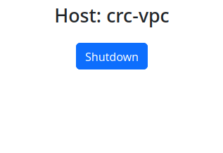

# web-powercycle

This project sets up a webserver that has a single purpose: Shutting down the system with a button click.



Once clicked, you have 1 minute to cancel the shutdown.
It effectively calls `shutdown --poweroff +1`.

## Installation

Install on Debian/Ubuntu (deb)

```bash
wget -O web-powercycle.deb https://github.com/ccremer/web-powercycle/releases/latest/download/web-powercycle_linux_amd64.deb
sudo dpkg -i web-powercycle.deb
```

Create a self-signed TLS certificate valid for 10 years.

```bash
sudo openssl req -new -newkey rsa:2048 -sha256 -days 3650 -nodes -x509 -keyout /etc/web-powercycle/cert.key -out /etc/web-powercycle/cert.crt
```

Configure authentication: Set `AUTH_USER` and `AUTH_PASS`.

```bash
editor /etc/default/web-powercycle
```

Start the service

```bash
sudo service web-powercycle start
```

Visit the app at `https://localhost:7443`

## Why

In times of ever-increasing electricity bills I'm stopping my previously-running 24/7 Linux server once I don't need it anymore.
I want to do this without having to SSH into the machine or plug the cord.

So I created this app, viewable from my phone and shutting it down with the click of a button.

## Security

Shutting down the system obviously needs some special permissions.
This is how it works:

1. Uses a dedicated user `web-powercycle`.
2. Uses basic auth, only allows TLS connections.
3. Invokes `shutdown --poweroff +1` when button clicked
4. `sudoers`-entry allows `sudo /usr/sbin/shutdown *` for `web-powercycle` user without password.

If you think this isn't secure enough, please either make an issue with a suggestion, or don't use this software :)
